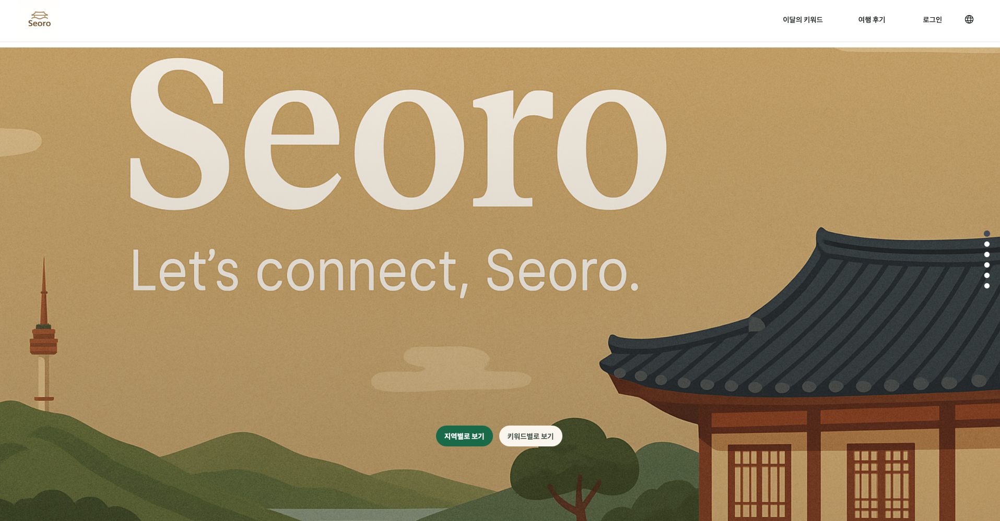
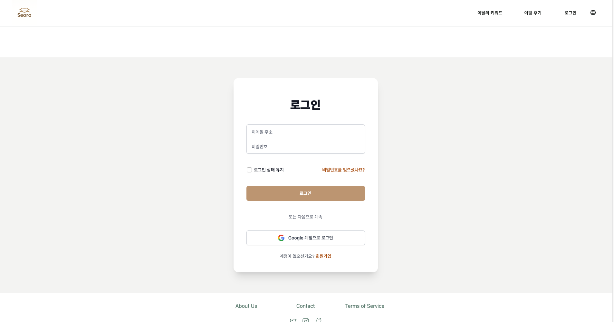
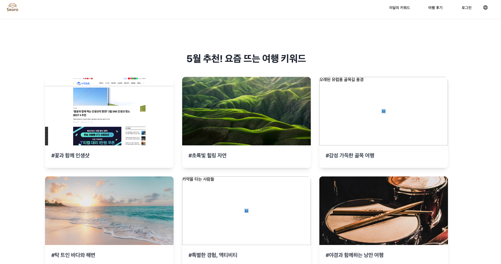

# Seoro - 외국인을 위한 국내 여행 플랫폼

## 프로젝트 개요

- **프로젝트 기간**: 2025.05 ~ (진행 중)
- **담당 역할**: Full Stack Developer

**Seoro**는 외국인(및 내국인) 사용자를 위한 새로운 국내 여행 웹 플랫폼입니다.
트렌드 이슈 해설, 여행 후기, 주간 핫플레이스 추천, AI 여행 플래너, 트립메이트 매칭 등 다양한 기능을 제공합니다.
Task Master(MCP)로 작업을 관리하며, React, Vite, Firebase 등 최신 웹 기술을 사용합니다.

---

## 실제 구동 예시

<p align="center">
  
</p>

<p align="center">
  <em>Seoro 메인 화면 예시</em>
</p>

<br />

<p align="center">
  
</p>
<p align="center">
  <em>로그인 페이지 예시</em>
</p>

<br />

<p align="center">
  
</p>
<p align="center">
  <em>AI 키워드 추천 및 코스 생성 예시</em>
</p>

## 사용 기술 및 설명

- **React**: 컴포넌트 기반의 UI 개발을 위한 프론트엔드 라이브러리. 빠른 렌더링과 재사용성이 강점입니다.
- **JavaScript**: 웹 프론트엔드의 표준 언어로, 동적 UI와 로직 구현에 사용합니다.
- **Vite**: 빠른 개발 환경과 빌드 속도를 제공하는 프론트엔드 빌드 도구입니다.
- **Firebase**: 인증, 실시간 데이터베이스(Firestore), 호스팅 등 다양한 백엔드 기능을 제공하는 BaaS(Backend as a Service) 플랫폼입니다. 초기 백엔드로 사용하며, 추후 Spring Boot로 마이그레이션 예정입니다.
- **styled-components**: CSS-in-JS 방식으로, 컴포넌트 단위로 스타일을 관리할 수 있습니다. (또는 Tailwind CSS 등 다른 CSS 솔루션 사용 가능)
- **Spring Boot**: Java 기반의 강력한 백엔드 프레임워크로, 대규모 서비스 확장에 적합합니다(마이그레이션 예정).
- **지도 API (Kakao/Google/Tmap 등)**: 국내 지도 서비스로, 여행지 위치 정보 및 지도 기능을 제공합니다.
- **OpenAI API / Gemini API**: AI 여행 플래너, 리뷰 요약 등 인공지능 기능 구현에 사용합니다.
- **외부 데이터 API (한국관광공사, Google Places 등)**: 트렌드, 여행지, 공식 리뷰 등 다양한 외부 데이터를 수집/활용합니다.
- **Firecrawl, Puppeteer**: 웹 크롤링을 통해 네이버 블로그 등에서 리뷰 데이터를 수집합니다.
- **d3.js**: 데이터 시각화(키워드 구름 등)에 활용할 수 있습니다.
- **dotenv / Vite 환경 변수**: 환경 변수 관리로, API 키 등 민감 정보를 안전하게 관리합니다.
- **ESLint, Prettier**: 코드 품질 및 일관성 유지를 위한 린팅 및 포맷팅 도구입니다.
- **git**: 버전 관리 및 협업을 위한 필수 도구입니다.
- **Task Master(MCP)**: 프로젝트 작업(Task) 관리 및 자동화 도구로, 한글로 작업을 관리할 수 있습니다.

---

## 폴더 구조 (project-seoro/seoro/ 내부 기준)

```plaintext
project-seoro/seoro/
├── public/                 # 정적 에셋 (favicon 등)
│   └── vite.svg
├── src/
│   ├── assets/             # 폰트, 아이콘 등 로컬 이미지 에셋
│   ├── components/         # 공통 UI 컴포넌트 (Header, Footer, Button 등)
│   ├── pages/              # 라우팅 단위 페이지 컴포넌트 (MainPage.jsx, LoginPage.jsx 등)
│   ├── services/           # API 호출, Firebase 연동 등 로직
│   ├── store/              # 전역 상태 관리 (Zustand, Redux 등)
│   ├── styles/             # 전역 스타일, 테마
│   ├── utils/              # 유틸리티 함수
│   ├── App.jsx             # 메인 애플리케이션 레이아웃 및 라우팅
│   ├── main.jsx            # React 애플리케이션 초기화 및 DOM 렌더링
│   └── firebaseConfig.js   # Firebase 초기화 설정
├── .env                    # 환경 변수 (API 키 등, git에 포함 X)
├── .eslint.cjs             # ESLint 설정 파일
├── .gitignore
├── .prettierrc.json        # Prettier 설정 파일
├── .prettierignore         # Prettier 무시 파일
├── index.html              # Vite 앱의 진입점 HTML
├── package.json
├── vite.config.js          # Vite 설정 파일
└── README.md               # (루트 폴더에 위치)
```

*위 구조는 일반적인 Vite + React 프로젝트 구조 예시이며, 실제 프로젝트 진행에 따라 변경될 수 있습니다.*

---

## 주요 기능

- **트렌드 이슈 해설**
  한국 여행 관련 최신 트렌드, 이슈, 키워드 해설 제공

- **여행 후기 공유 및 자동 수집**
  사용자들이 여행 후기를 남기고 소통하며, 외부 사이트(네이버 블로그, 인스타그램, 구글 플레이스)의 리뷰를 자동 수집하여 통합 제공

- **주간 핫플레이스 추천**
  실시간 트렌드, SNS, 관광공사 데이터를 활용한 인기 여행지 추천

- **AI 여행 플래너**
  OpenAI API (GPT-4), Gemini API 등을 활용하여 사용자 맞춤형 여행 일정 자동 생성
  <br />
  <p align="center">
    
  </p>

- **지도 기반 시각화**
  Tmap, KakaoMap, Google Maps API 등을 활용하여 여행 코스 및 장소 정보를 지도에 표시

- **코스 저장 및 마이페이지**
  사용자가 생성/저장한 코스를 마이페이지에서 확인하고 관리

- **소셜 공유 기능**
  생성된 여행 코스를 소셜 미디어에 공유

- **트립메이트 매칭**
  비슷한 일정이나 취향을 가진 다른 여행자들과 연결될 수 있는 기능

- **로그인/마이페이지/다국어 지원**
  Firebase Authentication을 이용한 소셜 로그인 및 이메일 가입, 내 정보 관리, 영어/한국어 등 다국어 지원
  <br />
  <p align="center">
    
  </p>

- **부분 유료화 모델**
  기본 기능은 무료로 제공하되, 고급 기능(LLM 사용량 증가, 메이트 프로필 조회수 증가 등)은 유료 구독 모델 적용

- **(예정) 백엔드 Spring Boot 마이그레이션**
  초기에는 Firebase BaaS를 적극 활용하고, 서비스 성장 및 기능 확장에 따라 주요 백엔드 로직을 Spring Boot로 마이그레이션 계획

---

## 설치 및 실행 방법

1.  **프로젝트 클론**
    ```bash
    git clone [레포지토리 주소]
    cd seoro-project/project-seoro/seoro
    ```

2.  **필수 환경 변수 설정**
    - `project-seoro/seoro/` 폴더 내에 `.env` 파일을 만들고, Firebase, OpenAI API 등 필요한 키 값을 입력합니다.
    ```env
    VITE_FIREBASE_API_KEY="YOUR_API_KEY"
    VITE_FIREBASE_AUTH_DOMAIN="YOUR_AUTH_DOMAIN"
    # ... 기타 필요한 환경 변수들
    ```

3.  **의존성 설치**
    ```bash
    npm install
    ```

4.  **개발 서버 실행**
    ```bash
    npm run dev
    ```
    - 브라우저에서 `http://localhost:5173` (또는 Vite가 지정하는 포트)로 접속합니다.

---

## 개발/운영 팁

- **컴포넌트/페이지 추가**
  `project-seoro/seoro/src/components/` 또는 `project-seoro/seoro/src/pages/`에 파일을 추가하고, `App.jsx` 등에서 라우팅 및 임포트하여 사용합니다.

- **스타일 가이드**
  `styled-components` 또는 선택한 CSS 솔루션의 가이드라인을 따릅니다. (컬러/폰트는 추후 디자인 가이드 확정)

- **API 키 관리**
  `.env` 파일에만 저장하고, 절대 Git에 커밋하지 않도록 주의합니다. (`.gitignore`에 `.env` 포함 확인)

- **작업 관리**
  Task Master(MCP)를 사용하여 할 일(Task)을 관리합니다.
  - 프로젝트 루트(`seoro-project/`)에서 `task-master list` 등의 명령어를 사용하거나, IDE에 통합된 MCP 도구를 활용합니다.
  - 작업 추가/분해/상태 변경 등은 한글로 편리하게 관리할 수 있습니다.

- **에러 발생 시**
  - 현재 작업 중인 터미널의 경로가 `project-seoro/seoro/`인지 확인합니다.
  - 파일명, import/export 문법, 변수명 등을 꼼꼼히 확인합니다.
  - 브라우저 개발자 도구의 콘솔 에러 메시지를 확인합니다.
  - Vite 개발 서버가 정상적으로 실행 중인지 확인합니다.

- **Git 관리**
  - 루트 `.gitignore` ([.gitignore](mdc:.gitignore)) 파일에 `project-seoro/seoro/node_modules/`, `project-seoro/seoro/dist/`, `.env` 등 민감하거나 불필요한 파일/폴더가 포함되어 있는지 확인합니다.
  - `tasks/` 폴더와 `.cursor/` 폴더도 `.gitignore`에 추가하여 버전 관리에서 제외하는 것을 권장합니다.

---

## 참고 자료

- [React 공식 문서](https://react.dev/)
- [Vite 공식 문서](https://vitejs.dev/)
- [Firebase 공식 문서](https://firebase.google.com/)
- [Kakao 지도 API](https://apis.map.kakao.com/)
- [OpenAI API](https://platform.openai.com/)
- [Task Master(MCP) 공식 문서](https://github.com/task-master-ai) (또는 관련 문서 링크)

---

## 기여 방법

1.  Task Master 또는 GitHub 이슈를 통해 할 일(Task)을 확인하고, 본인이 맡을 작업을 정합니다.
2.  작업 시작 전후로 Task Master에 상태 및 진행 상황을 업데이트합니다.
3.  기능 구현 후, 코드 포맷팅(`npm run format`) 및 린팅(`npm run lint`)을 실행하여 코드 품질을 점검합니다.
4.  작업 브랜치에서 변경 사항을 커밋하고, PR(Pull Request)을 생성하여 제출합니다.
5.  코드 리뷰 및 논의 후, 메인 브랜치에 머지합니다.

---

## 문의/도움이 필요할 때

- README, 코드, Task Master 사용법, Firebase 설정 등 프로젝트 진행 중 궁금한 점은 언제든 편하게 질문해 주세요!
- React, Vite, Firebase 등 웹 개발 경험이 처음이시거나 익숙하지 않으셔도 괜찮습니다.
- 함께 배우고 문제를 해결하며 프로젝트를 만들어나갔으면 좋겠습니다. 😊

---

이 README는 프로젝트 진행 상황에 따라 계속해서 업데이트될 예정입니다!
추가하고 싶거나 수정하고 싶은 내용이 있다면 언제든지 자유롭게 제안해주세요. 